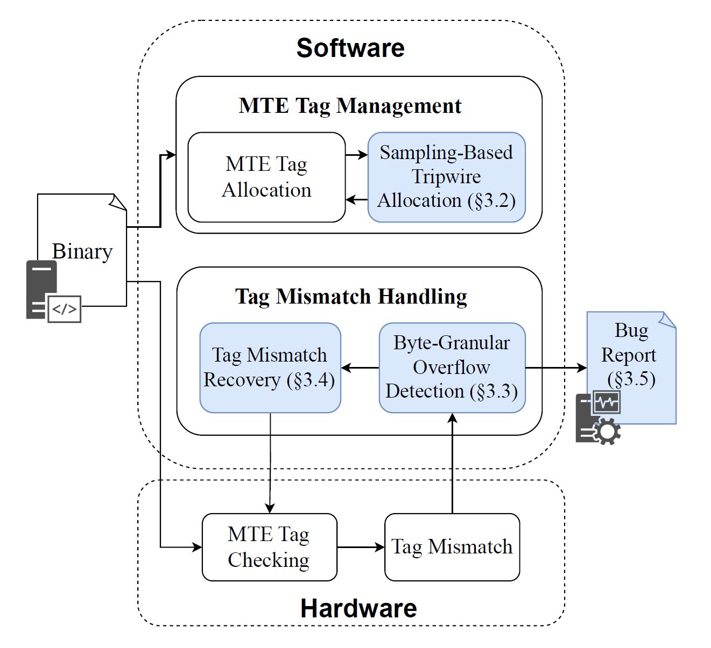

# NANOTAG: Systems Support for Efficient Byte-Granular Overflow Detection on ARM MTE

NANOTAG is a system to efficiently detect memory safety bugs probabilistically in unmodified MTE-enabled binaries at byte granularity, addressing intra-granule buffer overflows in real hardware to help in-house testing (e.g., fuzzing) detect such bugs with an explicit detection-performance tradeoff.



Please cite the following [paper](https://arxiv.org/abs/2509.22027) if you use NANOTAG's open-source artifact:

```
@inproceedings{li-nanotag-oakland-2026,
  title={NanoTag: Systems Support for Efficient Byte-Granular Overflow Detection on ARM MTE},
  author={Li, Mingkai and Ye, Hang and Devietti, Joseph and Jana, Suman and Khan, Tanvir Ahmed},
  booktitle={Proceedings of the 47th IEEE Symposium on Security and Privacy (SP)},
  year={2026},
  organization={IEEE}
}
```

## Pre-requisites

### Required Hardware

- An ARMv8.5+ CPU with MTE support. In our tested setup, we use Google Pixel 8 Pro phones, which are powered by the Google Tensor G3 SoC.

### Required Software

- A rooted Android operating system that supports MTE.
- Termux, a terminal emulator for Android, which can be installed from the Google Play Store.
- A chroot environment set up within Termux, such as Ubuntu 22.04 in our tested setup.

### Dependency Libraries

```sh
sudo apt update

sudo apt install -y build-essential cmake git python3 python3-pip clang
```

## Building NANOTAG

### Build Baseline MTE-Enabled Scudo

```sh
mkdir -p ~/baseline-runtime
cd baseline

clang++ -fPIC -std=c++17 -march=armv8.5-a+memtag -msse4.2 -O2 -pthread -shared \
  -I scudo/standalone/include -D SCUDO_USE_MTE_SYNC\
  scudo/standalone/*.cpp \
  -o ~/baseline-runtime/libscudo.so

cd -
```

### Build Tag Mismatch Handler

NANOTAG relies on a custom signal handler to detect tag mismatch faults. To build the handler, run the following command:

```sh
mkdir -p ~/mte-sanitizer-runtime
cd handler

clang -shared -fPIC -march=armv8.5-a+memtag -DINTERCEPT_SIGNAL_HANDLER -DFOPEN_INTERCEPT -DENABLE_DETAILED_REPORT -o ~/mte-sanitizer-runtime/handler.so handler.c

cd -
```

### Build NANOTAG's Custom Memory Allocator

NANOTAG uses a custom memory allocator (based on Scudo) to manage the metadata for byte-granular overflow detection. To build the allocator, run the following command:

```sh
mkdir -p ~/mte-sanitizer-runtime
cd scudo

clang++ -fPIC -std=c++17 -march=armv8.5-a+memtag -msse4.2 -O2 -pthread -shared \
  -I standalone/include \
  standalone/*.cpp \
  -o ~/mte-sanitizer-runtime/libscudo.so

cd -
```

## Run with Baseline MTE-Enabled Scudo

You can run your binary with the baseline Scudo runtime to detect memory safety bugs at the MTE's tag granularity (i.e., 16 bytes), when MTE is enabled on the device. To do so, use the following command:

```sh
LD_PRELOAD=~/baseline-runtime/libscudo.so <your_program>
```

If a crash occurs due to a memory safety bug, you will see a "Segmentation fault" error message on the terminal.

## Quick Start with NANOTAG

### Run with NANOTAG

To run your binary with NANOTAG, you can use the following command:

```sh
LD_PRELOAD=~/mte-sanitizer-runtime/handler.so:~/mte-sanitizer-runtime/libscudo.so <your_program>
```

This command will load both the custom signal handler and the custom memory allocator, enabling NANOTAG's byte-granular overflow detection capabilities. If a memory safety bug is detected, you can see a bug report like this:

```
Tag Mismatch Fault (SYNC). PC: 0x61572507fc, Instruction: 0x39405101, Fault Address: 0x505725fd24, Memory Tag: 0x0
[Register File Dump]
```

If the memory safety bug occurs in a short (partially allocated) granule, you can see a bug report like this:

```
Tag Mismatch Fault (SYNC). PC: 0x60b9f107fc, Instruction: 0x39402901, Fault Address: 0x40b9f16c1a, Memory Tag: 0x3, Address Tag: 0x3
Short Granule. Permitted Bytes: 5, Short Granule Start Byte: 10
[Register File Dump]
```

### Test with Sample Programs

We provide two sample programs in the `samples` directory to demonstrate NANOTAG's capabilities in detecting intra-granule buffer overflows. You can build and run these sample programs with both NANOTAG and the baseline MTE-enabled Scudo to see the difference in detection capabilities.

```sh
cd samples

clang test_oob_cross_granule.c -o test_oob_cross_granule
clang test_oob_short_granule.c -o test_oob_short_granule

# Run the sample programs with NANOTAG
LD_PRELOAD=~/mte-sanitizer-runtime/handler.so:~/mte-sanitizer-runtime/libscudo.so ./test_oob_cross_granule # Detected
LD_PRELOAD=~/mte-sanitizer-runtime/handler.so:~/mte-sanitizer-runtime/libscudo.so ./test_oob_short_granule # Detected

# Run the sample programs with the baseline MTE-enabled Scudo
LD_PRELOAD=~/baseline-runtime/libscudo.so ./test_oob_cross_granule # Detected
LD_PRELOAD=~/baseline-runtime/libscudo.so ./test_oob_short_granule # Not Detected
```

### Configure Detection-Performance Tradeoff

NANOTAG supports 3 configurable parameters to allow users to explicitly control the detection-performance tradeoff:

- `AllocThreshold`: The maximum number of allocations that will be allocated in the slow start phase.
- `SamplingRate`: The rate at which the allocation is sampled for byte-granular tagging after the slow start phase.
- `AccessThreshold`: The maximum number of accesses that will be checked for tag mismatches for a short granule.

You can set these parameters by exporting the following environment variables before running your program:

```sh
export SCUDO_ALLOCA_THRESHOLD=<value> # AllocThreshold
export SCUDO_SAMPLING_RATE=<value> # SamplingRate
export MTE_SANITIZER_THRESHOLD=<value> # AccessThreshold
```

At the beginning of the program execution, NANOTAG will print the configured parameters in the log. The default output looks like this:

```
SCUDO_SAMPLING_RATE not set, using default value: 1000
SCUDO_ALLOCA_THRESHOLD not set, using default value: 1000
SETTING SIGNAL HANDLER
MTE_SANITIZER_THRESHOLD not set. Using default value.
```
